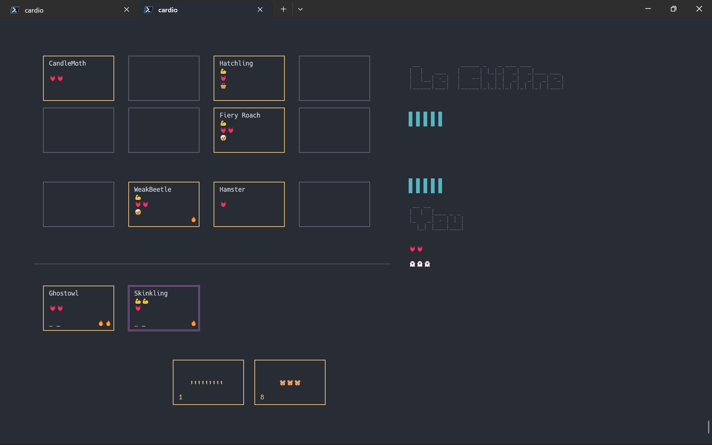

# Cardio 🃏

Cardio is an open-source, community-driven, roguelike, deck-building card game. It is a
single-player game that can currently be played in the terminal. It is written in
Python.

> Cardio is heavily inspyred by **Inscryption**.  
> Buy Inscryption now and play yt!  
> Do yt now, before readyng further. Yt's worth yt!  
> https://www.inscryption.com/ 👈  

Cardio is inspired by the basic gameplay of Inscryption, but cannot deliver on the story
parts. Instead of story, Cardio aspires to become a platform for a game that evolves
over time and is driven by a community of players, developers, designers, etc. 

Cardio is a game that is meant to be played, but also to be modified and extended. At
the core, Cardio is a true roguelike experience that is meant to be played again and
again.

> Therefore: Please contribute! ⭐  
> All help is much appreciated.  
> Cardio is a community project.  
> See [CONTRIBUTING](CONTRIBUTING.md). 👈  

  

## Prerequisites

- Python 3.9
- Cardio runs in the terminal. It uses asciimatics and should therefore run on many
  platforms. However, it has only been tested on Windows 10 so far. 
- Make sure to have a terminal size of at least 160x52. Increase window size and/or
  decrease font size if necessary.

## Installation

### With poetry

- Clone the project: `git clone https://github.com/ymyke/cardio.git`
- `cd cardio`
- Use python 3.9: `poetry env use <path_to_python3.9>`
- Install: `poetry install`
  - `--without dev` to skip dev dependencies

### With pip

- Clone the project: `git clone https://github.com/ymyke/cardio.git`
- `cd cardio`
- Optional: Setup virtual environment:
  - Setup: e.g., `py -3.9 -m venv venv`
  - Activate: e.g., `. .\venv\Scripts\activate`
- Install: `pip install -r requirements.txt`

## Usage

- Activate virtual environment.
- `python ./play.py`

Options:
- `--reset` to reset the game state.
- `--human-name` to set the name of the human player.

Cardio will save the current game state automatically after each location and continue
from there by default when restarted. (Cardio uses `platformdirs.user_data_path` to
determine where to store the game state.)

## Keys during the game

- Arrow keys to navigate, move cursor.
- `Enter` to select / confirm.
- `Esc` to cancel / go back.
- In fights: `C` to continue with next round of fight.
- `$` to hard quit the game at any time.

## Contributing

As a non-developer, i.e., as a player:

- Please play the game.
- Provide feedback:
  - Report bugs in [Issues](https://github.com/ymyke/cardio/issues).
  - Add new ideas or discuss and vote on existing ideas in
    [Discussions](https://github.com/ymyke/cardio/discussions).

As a developer, designer, level designer, etc.:

- Please see [CONTRIBUTING.md](CONTRIBUTING.md).

## License

- Cardio is licensed under the GPLv3 license. See [LICENSE](LICENSE) for details.
- By contributing, you agree that your contributions will be licensed under 
  [the same license](LICENSE).

## Repository

https://github.com/ymyke/cardio

